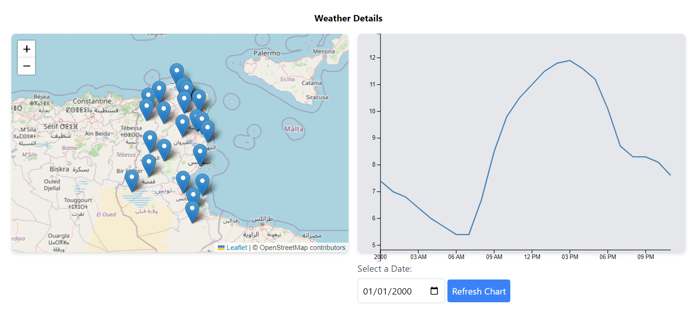
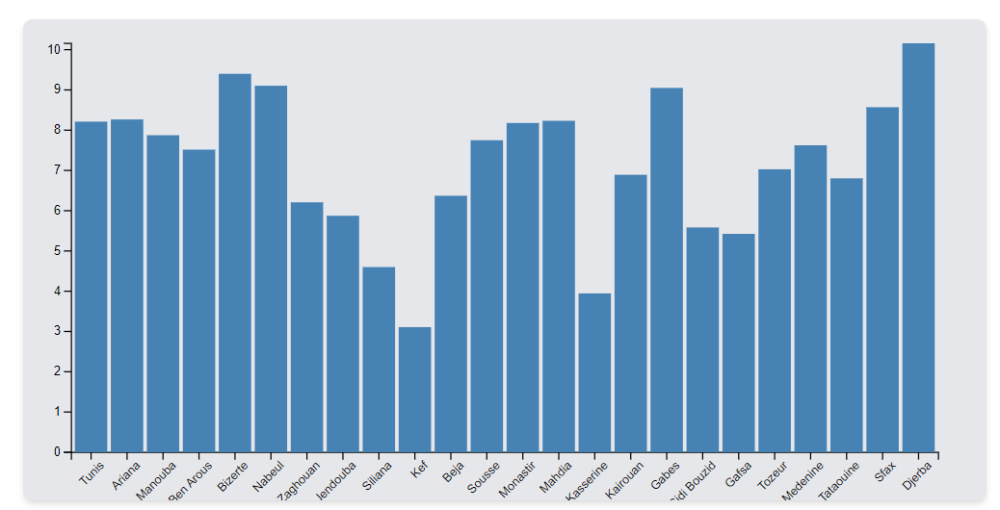
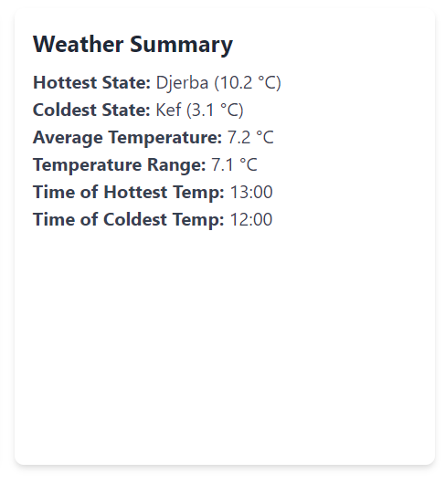
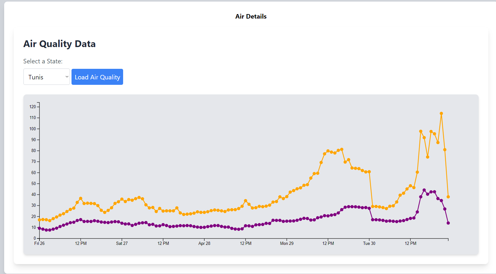

# Tunisia Weather Details

This project is a web application that provides historical weather data for the 24 states of Tunisia. It features a map to select a state and view weather details, including the average temperature and additional information for a specified day. The application also provides air quality data for a selected state.

## Features

- Interactive map to select states and view weather details.
- Average temperature of all states displayed in a bar chart.
- Specific weather details for a selected day.
- Air quality information for selected states in the upcoming days.

## Technologies Used

- HTML
- JavaScript
- D3.js for data visualization
- Leaflet for mapping

## Installation

To install and run the project locally, use the following steps:

1. Clone the repository:

```bash
git clone https://github.com/KoubaaMahdi/Tunisia-Weather-Details.git
```

2. Open the project in a web browser or a local server.

## Usage Examples

Here are some screenshots illustrating the application:

- **Map and Weather Chart**: The first image shows the interactive map with markers indicating the states of Tunisia. It also shows a weather chart displaying weather data over time.
.

- **Bar Chart of Average Temperatures**: The second image displays a bar chart representing the average temperatures of each state.
.

- **Weather Summary**: The third image shows a summary of weather statistics, including the hottest and coldest states, average temperature, temperature range, and times of hottest and coldest temperatures.
.

- **Air Quality Data**: The fourth image shows a line chart with air quality data for the selected state.
.

## Contributing

Contributions are welcome! If you'd like to contribute, please fork the repository and create a pull request with your changes.

## License

This project is licensed under the [MIT License](LICENSE).
